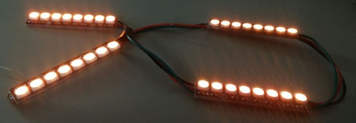
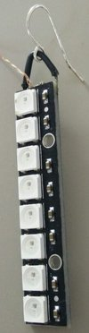
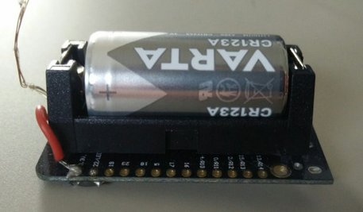
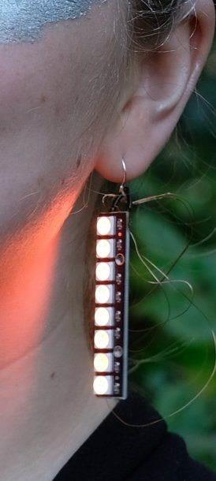

# SwitchPixel

This project contains code and documentation on how I built NeoPixels ESP32 wearables that can be remote controlled using a Nintendo Switch Pro Controller.

Concert video: https://www.youtube.com/watch?v=eoW7myD7VEc

## Electronics

Following materials are used:
- NeoPixel 8bit sticks (e.g. [here by AdaFruit](https://www.adafruit.com/product/1426))
- ESP32
- CR123 camera battery delivering 3V
- CR123 battery holder
- Enameled copper wire
- Wire

In hindsight an ESP32 is probably a bit of overkill, but I had some of them lying around.
The CR123 batteries were chosen as they should deliver a constant current of around 3 volts, even when almost depleted.
A good thing is, that the ESP32 can either run on 3v or 5v.
The NeoPixel can also be used with 3v, but is a bit less bright.

The goal was to keep the device as small and uncomplicated as possible, to reduce risk of failure during performance (we used it for a concert) and to not be distracting for actors or audience.
The enameled copper wire was used as it would be almost invisible.

The assembled device has the battery holder directly hot glued to the ESP32 microcontroller.
It is turned on and off by inserting and removing the battery.

## Firmware

Firmware for the ESP32 can be found in [npx_lights_fa.ino](./npx_lights_fa.h).
The device connects to a predefined Wifi network on startup.
Then it connects to a mosquitto server which will be contacted regularly with ping messages.

The ESP32 then is available to receive commands via the mosquitto protocol.

## Nintendo Switch Pro Controller Code
As I am using the HSV color model, in which the hue is aligned around a circle, the joysticks were super pratictal to directly set a desired hue.
The software for the controller is in [mqtt_client_controller.py](./mqtt_client_controller.py).
The controls are setup to control two device at the same time, divided by the left an right side of the controller.

## MQTT OpenWrt

A router running OpenWrt SNAPSHOT r19757-b515ad10a6 was used to provide Wifi network and mosquitto server functionality.
Mosquitto was installed using the openwrt package manager and run on startup.

# Images

The headband that was put around a hair bun:

Earrings, these were really finnicky to solder:

Device:

In action:

